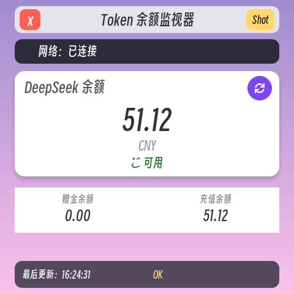

# eMP_tokenMonitor

DeepSeek Token / 余额监视器（LVGL 界面），面向 Allwinner T113-S3 板子与 PC 模拟器。

## 功能

- 定时请求 DeepSeek 余额接口 `GET https://api.deepseek.com/user/balance`
- 网络连通性检测（网络状态点实时显示）
- 优雅展示：总余额、币种、赠金余额、充值余额、是否可用
- 支持手动刷新（只旋转按钮内图标，按钮本体不动）、截图（Shot 按钮）
- **自动网络对时**（仅 ARM 编译启用）：板子无 RTC 时，启动立刻 + 每 60s 通过 HTTP 对时并 `settimeofday`，
  免手动 `date -s`；HTTP 源先主后备（WorldTimeAPI `unixtime` → Baidu `Date` 头）
- 基于 `cpp-httplib`（HTTPS）发起请求，`nlohmann/json` 解析响应

## 环境

方式一：完整 tina-sdk（已安装 SDK 的机器）：

```shell
# 交叉编译需要（请按本机实际路径修改）
export STAGING_DIR=/home/hugokkl/tina-sdk/out/t113-pi/staging_dir/target
```

方式二：**独立工具链仓库（无需完整 SDK）**：

```shell
git clone https://github.com/ZhangKeLiang0627/eMP-toolchain
cd eMP-toolchain && ./setup.sh        # 解压 toolchain/ 与 sysroot/

export T113_SDK=/path/to/eMP-toolchain
export STAGING_DIR=$T113_SDK/sysroot
# 之后 make CROSS=1 / cmake 交叉编译即可，无需 tina-sdk
```

> `T113_SDK` 设置后，Makefile 与 `cmake/build_for_t113s3.cmake` 自动使用
> `$T113_SDK/toolchain/bin/`（编译器）与 `$T113_SDK/sysroot`（头文件/库），
> 未设置时回退到本机 tina-sdk 绝对路径。

本地编译依赖：

```bash
sudo apt install build-essential libsdl2-dev libfreetype6-dev libncurses5-dev libssl-dev
```

## 配置

编辑 `./config/eMP_tokenMonitor.json`：

```json
{
  "api_key": "sk-你的DeepSeek密钥",
  "refresh_interval_sec": 30
}
```

- `api_key`：DeepSeek API Key（**必填**）
- `refresh_interval_sec`：余额拉取周期，单位秒（最小 5 秒）

> 注意：配置文件名为 `eMP_tokenMonitor.json`，与 mainPage 的 `sysconfig.json` 区分，互不冲突。

## 编译

- Makefile
```shell
# 交叉编译（目标板 T113-S3）
./build.sh

# 本地编译（PC 模拟器）
./build.sh 0
```

- CMake
```shell
# 本地编译
mkdir build && cd build
cmake ..
make -j32

# 交叉编译（目标板 T113-S3）
export STAGING_DIR=/home/hugokkl/tina-sdk/out/t113-pi/staging_dir/target
mkdir build && cd build
cmake -DCMAKE_TOOLCHAIN_FILE=cmake/build_for_t113s3.cmake ..
make -j32

# 交叉编译（独立工具链，无 tina-sdk 时）
export T113_SDK=/path/to/eMP-toolchain
export STAGING_DIR=$T113_SDK/sysroot
mkdir build && cd build
cmake -DCMAKE_TOOLCHAIN_FILE=cmake/build_for_t113s3.cmake -DT113_SDK=$T113_SDK ..
make -j32
```

## 运行

可执行文件为：`eMP_tokenMonitor`

```shell
./eMP_tokenMonitor
```

> 本地编译需要 `/mnt/UDISK/font/SmileySans.ttf` 中文字体，缺失时自动回退为英文界面（montserrat 字体）。

## 部署到 T113-S3 板子

目标板：Allwinner T113-S3，TinaLinux（dropbear），通过 U 盘分区 `/mnt/UDISK` 承载应用。

```bash
# 1. 交叉编译
export STAGING_DIR=/home/hugokkl/tina-sdk/out/t113-pi/staging_dir/target
./build.sh

# 2. 部署二进制到板子 /mnt/UDISK
scp eMP_tokenMonitor root@<板子IP>:/mnt/UDISK/

# 3. 部署配置（含 API Key）
scp config/eMP_tokenMonitor.json root@<板子IP>:/mnt/UDISK/config/

# 4. 在板子上运行
ssh root@<板子IP> "cd /mnt/UDISK && ./eMP_tokenMonitor"
```

板子上 `/mnt/UDISK` 典型布局（与 mainPage / settings 等并列）：

```text
/mnt/UDISK/
├── eMP_mainPage / eMP_settings / eMP_video / ...   # 各应用二进制
├── eMP_tokenMonitor                                # 本应用
├── config/                                         # 配置目录（本应用用 eMP_tokenMonitor.json）
├── font/SmileySans.ttf                             # 中文字体
└── logs/                                           # 日志
```

无显示环境自测（自动截图）：`EMP_AUTOSHOT=<秒> ./eMP_tokenMonitor`，会在当前目录生成 `screenshot-*.png`。

## ✅ 已验证：Allwinner T113-S3 板子

已在 T113-S3（TinaLinux，`/mnt/UDISK` 部署，480×480 sunxifb 屏）上完整验证：

- 交叉编译：`make CROSS=1 -j8` 产出 `eMP_tokenMonitor`（ARM 32-bit，musl 动态链接，约 1.7 MB）
- 部署到 `/mnt/UDISK/eMP_tokenMonitor` + `/mnt/UDISK/config/eMP_tokenMonitor.json`
- 依赖的动态库（板子已具备）：`libstdc++.so.6`(`/lib/`)、`libfreetype.so.6`、`libssl.so.1.1`、`libcrypto.so.1.1`、`libz.so.1`、`libbz2.so.1.0`、musl `libc`/`ld-musl-armhf`
- 字体：`/mnt/UDISK/font/SmileySans.ttf`（FreeType 加载中文字体）
- 实际运行日志：`wh=480x480, vwh=480x960, bpp=32` → `config loaded, key_len=35` → `fetchBalance: OK, infos=1, available=1` → 截图保存
- **注意**：T113-S3 板子无 RTC，默认时钟为 1970，HTTPS 证书会因 "not yet valid" 失败。
  **本应用已自带网络对时**：ARM 编译时启用，启动时立刻通过 `http://worldtimeapi.org/api/ip`
  取 `unixtime`（失败则回退到 `http://www.baidu.com` 的 Date 响应头），然后 `settimeofday`；
  之后数据线程每 60s 周期再对时一次。所以板子无需再手动 `date -s`。

## 文件

- `./config/eMP_tokenMonitor.json`：API Key 与拉取周期配置
- `./src/Net/DeepSeekClient.cpp`：DeepSeek 余额请求（cpp-httplib + nlohmann/json）
- `./src/Net/TimeSync.cpp`：网络对时（WorldTimeAPI / Baidu Date 头，`settimeofday`）
- `./src/Page/View.cpp`：界面（LVGL）
- `./src/Page/Model.cpp`：数据线程 / 定时刷新 / 周期对时 / 状态管理

## 截图


